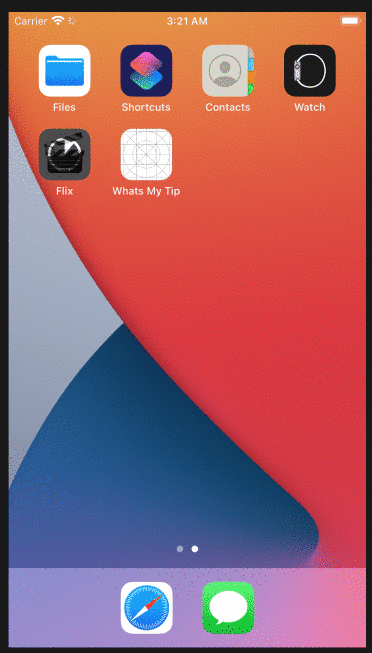
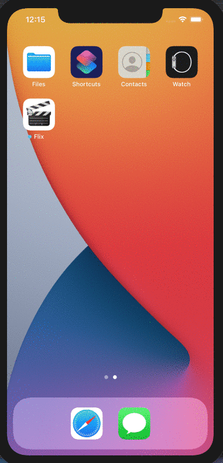
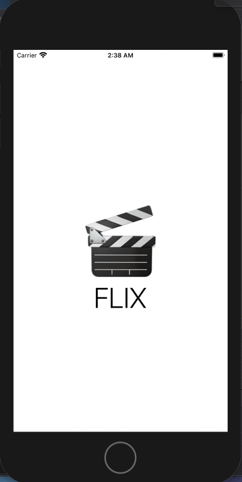

# Flix

## Flix Part 2

### User Stories

#### REQUIRED (10pts)
- [x] (5pts) User can tap a cell to see more details about a particular movie.
- [x] (5pts) User can tap a tab bar button to view a grid layout of Movie Posters using a CollectionView.

#### BONUS
- [x] (2pts) User can tap a poster in the collection view to see a detail screen of that movie.
- [ ] (2pts) In the detail view, when the user taps the poster, a new screen is presented modally where they can view the trailer.

GIF created with [Recordit](https://recordit.co/).

### Notes
Describe any challenges encountered while building the app.
I forget to modify the estimate size of my collection view, took me forever to figure out what was wrong. Later i figured out i had to set the estimate size to none from automatic

Flix is an app that allows users to browse movies from the [The Movie Database API](http://docs.themoviedb.apiary.io/#).
Submitted by: **Tahmid Zaman**

Time spent: **~10** hours spent in total

---

## Flix Part 1

### User Stories

#### REQUIRED (10pts)
- [x] (2pts) User sees an app icon on the home screen and a styled launch screen.
- [x] (5pts) User can view and scroll through a list of movies now playing in theaters.
- [x] (3pts) User can view the movie poster image for each movie.

#### BONUS
- [x] (2pt) User can view the app on various device sizes and orientations.
- [x] (1pt) Run your app on a real device.

### App Walkthrough GIF
 Running on iphone 11:

 Running on iphone 8 plus (vertical)
 
 

 
 Running on iphone 8 plus (horizontal)
 
 

 GIF created with [Recordit](https://recordit.co/).

 
 
 
### Notes
Describe any challenges encountered while building the app.
- Getting the posterView to work was tedious
- Figuring out autolayout and how the constraints work
